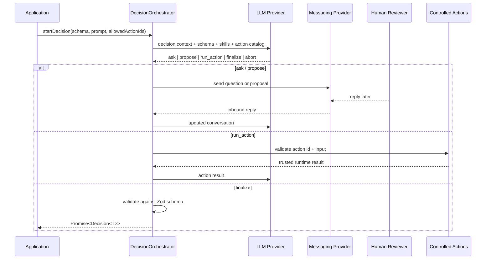

# Harmony - Agentic Decisions For Node.js Workflows

<p align="center">
  
</p>

<p align="center">
  <strong>Typed, production-oriented human-in-the-loop decision workflows for Node.js.</strong>
</p>

<p align="center">
  Let an LLM drive the conversation, let a real person answer asynchronously on a real channel,
  and get back a typed decision your application can trust.
</p>

<p align="center">
  
  
  
  
  
  
</p>

## Index

- [1. Why and Fit](#why-this-library-exists)
  - [1.1 Compute Footprint (Harmony vs OpenClaw)](#compute-footprint-harmony-vs-openclaw)
  - [1.2 Quick decision guide](#quick-decision-guide)
    - [When to use Harmony](#when-to-use-harmony)
    - [When not to use Harmony](#when-not-to-use-harmony)
    - [Advantages](#advantages)
    - [Trade-offs](#trade-offs)
- [2. Fast Implementation Path](#quick-start)
  - [2.1 Install](#install-)
  - [2.2 `llm.txt` (recommended first)](#llmtxt-)
  - [2.3 Quick Start](#quick-start)
- [3. Product Overview](#highlights-)
  - [Architecture](#architecture-)
- [4. Workflow Model](#core-concepts)
  - [Portable / Registry Skills](#portable--registry-skills)
  - [Controlled Actions](#controlled-actions)
  - [Messaging Channels](#messaging-channels)
  - [LLM Providers](#llm-providers)
  - [Persistence and Rehydration](#persistence-and-rehydration)
  - [Security Model](#security-model)
  - [Reliability Defaults](#reliability-defaults)
- [5. API and Usage](#public-api)
  - [Examples Included In This Repository](#examples-included-in-this-repository)
  - [Internal Entry Point](#internal-entry-point)
- [6. Project Lifecycle](#development)
  - [Contributing](#contributing)
  - [Opening Issues](#opening-issues)
  - [Publishing](#publishing)
  - [License](#license)

---

`harmony-agentic-decisions` is built for workflows where an LLM should not silently decide on its own.
It gives you a runtime that can ask follow-up questions, collect replies over time, run a tightly
controlled set of actions, and finalize only when the result passes your schema and confidence rules.

This is a better fit than a one-shot chat completion when you need things like:

- deployment approvals
- release sign-offs
- incident triage
- content review loops
- operational workflows that pause and resume across messaging channels

## Why This Library Exists 🎯

Most LLM integrations stop at "prompt in, JSON out". Real decision workflows are messier:

- the model often needs one more question before it can decide
- the human answer may arrive minutes later on another channel
- the runtime may need to inspect trusted context before proposing anything
- the final value must match a strict schema before the application continues

Harmony gives you that missing orchestration layer.

## Compute Footprint (Harmony vs OpenClaw) ⚙️

If your target is low-cost infrastructure (for example small DigitalOcean droplets), Harmony is optimized for lightweight Node.js orchestration and avoids browser/runtime-heavy defaults.

The following values are practical deployment ranges (not vendor-official benchmarks) and should be validated in your own workload:

| Profile | Harmony (this repo) | OpenClaw (typical full-agent setup) |
| --- | --- | --- |
| Typical runtime style | Pure Node orchestration + optional messaging adapters | Broader autonomous-agent runtime, commonly with heavier tool stacks |
| Baseline RAM (idle process) | ~70-160 MB | ~220-700 MB (especially when browser/tool workers are enabled) |
| CPU behavior | Usually bursty only during turns/actions | Higher sustained load when autonomous loops or browser automation run |
| Packaging signal | npm pack unpacked size ~531.9 kB (dry-run) | Usually larger install/runtime surface depending on enabled modules |
| Best fit | Approval and decision workflows with bounded actions | Broad autonomous workflows where larger runtime overhead is acceptable |

### Practical droplet guidance 💡

- `1 vCPU / 1 GB RAM`: Harmony is generally viable for low concurrency decision workflows.
- `2 vCPU / 2 GB RAM`: comfortable headroom for Harmony with Redis + messaging adapters.
- Prefer Harmony when you need predictable operational costs and controlled execution boundaries.
- Prefer OpenClaw when you need broader autonomy and can afford higher memory/CPU budget.

## Quick decision guide 🧭

### When to use Harmony

- ✅ You need human approval before critical actions (deployments, releases, incident responses)
- ✅ You want typed final outputs with strict schema validation
- ✅ You run Node.js services on small/medium VMs (like 1-2 vCPU droplets) and need predictable overhead
- ✅ You need asynchronous messaging workflows (human replies later, session resumes safely)

### When **not** to use Harmony

- ⚠️ You only need single-shot prompt/response with no human-in-the-loop workflow
- ⚠️ You need fully autonomous browser-heavy agents as your primary runtime model
- ⚠️ You cannot define explicit allowlisted actions and prefer unrestricted tool execution

### Advantages

- 🧠 Typed orchestration and schema-gated finalization
- 🔒 Controlled action execution (host-defined, model cannot invent raw shell commands)
- 💸 Small runtime footprint and easy deployment in constrained Node environments
- 🧩 Built-in reliability (timeouts, retries, circuit breakers, resumable sessions)

### Trade-offs

- 🛠️ More orchestration setup than plain chat completion calls
- 📐 You must design actions and schemas thoughtfully for each workflow
- 🎯 It is purpose-built for decision workflows, not a general unrestricted agent framework

## Highlights ✨

- Typed orchestration through `DecisionOrchestrator`
- Async human replies over `console`, Telegram, WhatsApp Web, or a custom provider
- Zod-validated final payloads with automatic JSON repair loops
- Contextual `skills` to steer the model only when relevant
- Portable skill import from local directories, ZIPs, generic URLs, SkillHub, and ClawHub
- Controlled `actions` with allow-by-id execution
- Safe-by-default shell actions with minimal inherited environment variables
- Prompt-injection screening, input sanitization, and error redaction utilities
- Retry, timeout, circuit-breaker, and cost-tracking primitives
- In-memory and Redis-backed session stores
- Rehydration support for resumable sessions after restart
- `llm.txt` included in the published package for downstream codegen workflows

## Architecture 🏗️

<details>
<summary>Ver diagrama de arquitectura</summary>



</details>

## Install 📦

Install the package:

<details>
<summary>Ver comando de instalación</summary>

```bash
pnpm add harmony-agentic-decisions
```

</details>

Then add only the integrations you actually need:

<details>
<summary>Ver dependencias opcionales por integración</summary>

```bash
# LLM providers
pnpm add openai
pnpm add @anthropic-ai/sdk
pnpm add @google/generative-ai

# Messaging channels
pnpm add node-telegram-bot-api
pnpm add whatsapp-web.js qrcode-terminal

# Optional persistence
pnpm add ioredis
```

</details>

## `llm.txt` 🤖

To implement faster, start with `llm.txt` right after install.
It is a compact integration reference you can paste to another coding model to generate app-specific wiring.

- Recommended flow: install package -> open/read `llm.txt` -> adapt Quick Start to your app
- Best use: bootstrap orchestration, providers, and action contracts quickly

When installed from npm, it is available at the package root and exported as `harmony-agentic-decisions/llm.txt`.

## Quick Start

### Minimal OpenAI + Console flow

<details>
<summary>Ver ejemplo mínimo OpenAI + Console</summary>

```ts
import { z } from 'zod';
import OpenAI from 'openai';
import {
  ConsoleProvider,
  DecisionOrchestrator,
  OpenAIProvider,
  type OpenAILike,
} from 'harmony-agentic-decisions';

const ApprovalSchema = z.object({
  approved: z.boolean(),
  reason: z.string().optional(),
});

const orchestrator = new DecisionOrchestrator({
  llm: new OpenAIProvider({
    client: new OpenAI({
      apiKey: process.env.OPENAI_API_KEY!,
    }) as unknown as OpenAILike,
    model: 'gpt-4o-mini',
  }),
  messaging: [new ConsoleProvider({ externalUserId: 'local-user' })],
  skills: [
    {
      id: 'release-review',
      description: 'Gather release evidence before recommending deployment.',
      instructions:
        'Ask focused questions, inspect trusted runtime context when needed, and finalize only after confirmation.',
      preferredActionIds: ['inspect_release_notes'],
    },
  ],
  actions: [
    {
      id: 'inspect_release_notes',
      title: 'Inspect release notes',
      description: 'Loads a trusted release summary from the application runtime.',
      kind: 'handler',
      inputSchema: z.object({}),
      execute: async () => ({ summary: 'Release notes are internally consistent.' }),
    },
  ],
});

const decision = await orchestrator.startDecision({
  prompt: 'Decide whether tonight's deployment should proceed.',
  userId: 'release-manager',
  channel: 'console',
  externalUserId: 'local-user',
  schema: ApprovalSchema,
  skillIds: ['release-review'],
  allowedActionIds: ['inspect_release_notes'],
  kickoffMessage: 'Deployment review started. Please answer in the terminal.',
});

console.log(decision.status, decision.value);
await orchestrator.stop();
```

</details>

### Local demo with no API keys

This repository ships with local demos so you can verify the orchestration flow before wiring a real model.

<details>
<summary>Ver comandos de demos locales</summary>

```bash
pnpm install
pnpm demo:local
pnpm demo:actions
pnpm demo:imported-skill
```

</details>

## Core Concepts

### 1. The LLM never executes arbitrary capabilities

The model can only emit one of five actions:

<details>
<summary>Ver protocolo de acciones del modelo</summary>

```json
{ "action": "ask", "question": "...", "reasoning": "..." }
{ "action": "propose", "proposal": "...", "confidence": 0.82, "reasoning": "..." }
{ "action": "run_action", "actionId": "run_tests", "input": {}, "progressMessage": "Running checks now.", "reasoning": "..." }
{ "action": "finalize", "value": { "...": "..." }, "confidence": 0.97, "reasoning": "..." }
{ "action": "abort", "reason": "..." }
```

</details>

There are no raw shell commands in the model protocol. If you expose runtime capabilities, you do it by registering named actions up front.

### 2. Each decision opts into a subset of power

The orchestrator owns the global registries for `skills` and `actions`, but each decision narrows them with:

- `skillIds`
- `allowedActionIds`

That lets you keep a rich runtime available without giving every workflow the same authority.

### 3. Finalization is gated

Harmony will not accept a `finalize` action unless:

- the user explicitly confirmed the proposal, or
- the confidence gate allows automatic finalization

The final payload must still pass your Zod schema before the promise resolves.

## Portable / Registry Skills 🔌

Static `skills` still work exactly as before, but you can now also import portable `SKILL.md` bundles through `skillSources`.

Supported source kinds in v1:

- local directory
- local ZIP
- generic remote URL
- ClawHub page or ZIP

Imported skills are still host-controlled. The model does not discover or download them automatically, and they only become active for a decision when you opt in through `skillIds`.

### Load a local portable skill

<details>
<summary>Ver carga de skill portable local</summary>

```ts
import { DecisionOrchestrator } from 'harmony-agentic-decisions';

const orchestrator = new DecisionOrchestrator({
  llm,
  messaging: [consoleProvider],
  skillSources: [
    {
      kind: 'directory',
      path: '/absolute/path/to/portable-skill',
    },
  ],
});

await orchestrator.startDecision({
  prompt: 'Review tonight\'s deployment.',
  userId: 'release-manager',
  channel: 'console',
  externalUserId: 'local-user',
  schema: ApprovalSchema,
  skillIds: ['portable-release-review'],
});
```

</details>

### Import helpers

You can also import skills yourself before wiring them into the orchestrator:

<details>
<summary>Ver helpers de importación de skills</summary>

```ts
import {
  loadSkillFromClawHub,
  loadSkillFromDirectory,
  loadSkillFromUrl,
  loadSkillFromZip,
  writeImportedSkill,
} from 'harmony-agentic-decisions';

const localSkill = await loadSkillFromDirectory('/skills/release-review');
const zipSkill = await loadSkillFromZip('/tmp/release-review.zip');
const remoteSkill = await loadSkillFromUrl('https://example.com/skills/release-review.zip');
const clawHubSkill = await loadSkillFromClawHub('https://clawhub.ai/skills/release-review');

await writeImportedSkill(remoteSkill, '/explicit/output/directory');
```

</details>

### SkillHub catalog search

SkillHub catalog access is explicit and API-key based:

<details>
<summary>Ver búsqueda en catálogo SkillHub</summary>

```ts
import { SkillHubRegistryClient, loadSkillFromUrl } from 'harmony-agentic-decisions';

const registry = new SkillHubRegistryClient({
  apiKey: process.env.SKILLHUB_API_KEY!,
});

const matches = await registry.search({ query: 'release review', limit: 5 });
const first = matches[0];
if (first?.pageUrl) {
  const imported = await loadSkillFromUrl(first.pageUrl);
  console.log(imported.id, imported.description);
}
```

</details>

### Security policy for imported skills

- remote imports are opt-in only
- the runtime never downloads a skill because the prompt asked for it
- bundled `scripts/`, `references/`, and `assets/` are exposed as resource inventory, not executable permissions
- `allowed-tools` is preserved as metadata only and is not auto-mapped to `allowedActionIds`
- `writeImportedSkill()` writes only when the host application chooses an explicit target directory

## Controlled Actions 🛡️

Actions are the difference between "the model guessed" and "the runtime checked".

### Handler actions

Use handler actions when the capability lives inside your application:

<details>
<summary>Ver ejemplo de handler action</summary>

```ts
{
  id: 'read_release_summary',
  title: 'Read release summary',
  description: 'Returns trusted deployment metadata from the app runtime.',
  kind: 'handler',
  inputSchema: z.object({}),
  execute: async (_ctx, _input) => ({
    version: '2026.04.22',
    risk: 'low',
  }),
}
```

</details>

### Shell actions

Use shell actions when you want tightly bounded CLI execution:

<details>
<summary>Ver ejemplo de shell action</summary>

```ts
{
  id: 'run_focused_tests',
  title: 'Run focused tests',
  description: 'Runs the targeted Vitest suite.',
  kind: 'shell',
  inputSchema: z.object({}),
  command: process.platform === 'win32' ? 'pnpm.cmd' : 'pnpm',
  buildArgs: () => ['exec', 'vitest', 'run', 'test/AgentEngine.test.ts'],
  cwd: process.cwd(),
  envAllowlist: ['CI'],
}
```

</details>

Important runtime guarantees:

- the command is fixed by the host application
- the model can only supply validated input through your schema
- only base OS variables are inherited by default
- extra environment variables must be explicitly allowlisted

## Messaging Channels 💬

Bundled channels:

| Provider | Purpose | Notes |
| --- | --- | --- |
| `ConsoleProvider` | Local development and demos | Great for smoke testing workflows |
| `TelegramProvider` | Telegram bots | Wraps `node-telegram-bot-api` shape without hard compile-time coupling |
| `WhatsAppWebProvider` | Real WhatsApp Web client integration | Works with a `whatsapp-web.js`-compatible client shape |
| `WhatsAppStubProvider` | Lightweight adapter for custom WhatsApp wiring | Good for tests, demos, or user-managed clients |

Every messaging provider implements:

<details>
<summary>Ver interfaz MessagingProvider</summary>

```ts
interface MessagingProvider {
  readonly name: string;
  start(): Promise<void>;
  stop(): Promise<void>;
  send(to: string, msg: OutboundMessage): Promise<void>;
  onReply(handler: InboundHandler): () => void;
}
```

</details>

## LLM Providers 🧠

Bundled LLM adapters:

| Provider | Class |
| --- | --- |
| OpenAI | `OpenAIProvider` |
| Anthropic | `AnthropicProvider` |
| Gemini | `GeminiProvider` |
| OpenRouter | `OpenRouterProvider` |
| Multi-provider fallback | `FallbackChain` |

### Fallback chains

<details>
<summary>Ver ejemplo de fallback entre proveedores</summary>

```ts
import {
  AnthropicProvider,
  FallbackChain,
  GeminiProvider,
  OpenAIProvider,
} from 'harmony-agentic-decisions';

const llm = new FallbackChain({
  providers: [openaiProvider, anthropicProvider, geminiProvider],
  stepTimeoutMs: 30_000,
  retryPerProvider: 2,
});
```

</details>

`FallbackChain` combines:

- per-provider retries
- circuit breakers
- timeout-based provider failover

## Persistence and Rehydration ♻️

Use a store when decisions may outlive the current process.

Bundled stores:

- `InMemoryStateStore`
- `RedisStateStore`

### Resuming after restart

To resume a session, configure a `rehydrator` that maps persisted state back to the schema for that workflow:

<details>
<summary>Ver ejemplo de rehidratación</summary>

```ts
const orchestrator = new DecisionOrchestrator({
  llm,
  messaging: [consoleProvider],
  store: redisStore,
  rehydrator: async (session) => {
    if (session.metadata?.workflow === 'release-review') {
      return { schema: ApprovalSchema };
    }
    return null;
  },
});
```

</details>

If the process restarts and a stored session cannot be rehydrated, the library now aborts that stale active session instead of leaving it permanently locked.

### Decision usage and cost metadata

`Decision<T>` includes both a coarse `costUsd` total and a structured `usage` summary when the underlying provider returns token accounting:

<details>
<summary>Ver lectura de métricas de uso/costo</summary>

```ts
const decision = await orchestrator.startDecision({ ... });

console.log(decision.status);
console.log(decision.costUsd);
console.log(decision.usage?.totalTokens);
console.log(decision.usage?.calls);
```

</details>

## Security Model 🔐

This library is designed to reduce common agent-runtime failure modes, not eliminate the need for application-level review.

### Built-in safeguards

- `InputSanitizer` strips control characters, zero-width characters, and oversized input
- `PromptGuard` isolates user content inside `<user_input>` blocks and flags injection-like patterns
- `OutputValidator` extracts JSON and validates it with Zod
- `ActionExecutor` uses fixed commands plus validated args, not model-generated shell text
- `createLogger()` redacts common identity and credential fields by default
- `sanitizeErrorMessage()` scrubs common secrets from logged error text
- imported skills are data-only context unless your host explicitly turns their resources into runtime actions

### What you should still assume

- finalized LLM output is still untrusted application input
- handler actions are trusted code and should be written defensively
- shell actions should be narrow, auditable, and explicitly allowlisted per decision
- imported skill bundles may come from untrusted sources and should be treated as content, not executable code
- business rules still belong in your application, not only in the model prompt

## Reliability Defaults 🧱

| Setting | Default |
| --- | --- |
| `llmTimeoutMs` | `30000` |
| `userReplyTimeoutMs` | `600000` |
| `maxTurns` | `20` |
| `ConfidenceGate.autoFinalizeThreshold` | `0.98` |
| `ConfidenceGate.minConfirmThreshold` | `0.6` |

Small reliability building blocks are also exported directly:

- `retry`
- `withTimeout`
- `CircuitBreaker`
- `CostTracker`

## Public API 🧩

### `DecisionOrchestrator`

<details>
<summary>Ver API de `DecisionOrchestrator`</summary>

```ts
new DecisionOrchestrator(options: OrchestratorOptions)

orchestrator.start(): Promise<void>
orchestrator.stop(): Promise<void>
orchestrator.startDecision<T>(request: StartDecisionRequest<T>): Promise<Decision<T>>
orchestrator.on(event, listener): this
```

</details>

### `OrchestratorOptions`

<details>
<summary>Ver interfaz `OrchestratorOptions`</summary>

```ts
interface OrchestratorOptions {
  llm: LLMProvider;
  messaging: readonly MessagingProvider[];
  skills?: readonly SkillDefinition[];
  skillSources?: readonly SkillSource[];
  actions?: readonly ActionDefinition[];
  store?: StateStore;
  rehydrator?: SessionRehydrator;
  logger?: Logger;
  costTracker?: CostTracker;
  gate?: ConfidenceGate;
  systemPrompt?: string;
  maxTurns?: number;
  userReplyTimeoutMs?: number;
  llmTimeoutMs?: number;
  llmTemperature?: number;
  llmMaxTokens?: number;
}
```

</details>

### `StartDecisionRequest<T>`

<details>
<summary>Ver interfaz `StartDecisionRequest<T>`</summary>

```ts
interface StartDecisionRequest<T> {
  prompt: string;
  userId: string;
  channel: string;
  externalUserId: string;
  schema: ZodType<T>;
  metadata?: Readonly<Record<string, string | number | boolean>>;
  kickoffMessage?: string;
  skillIds?: readonly string[];
  allowedActionIds?: readonly string[];
}
```

</details>

### `Decision<T>`

<details>
<summary>Ver interfaz `Decision<T>`</summary>

```ts
interface Decision<T> {
  status: 'finalized' | 'aborted' | 'timeout';
  value: T | null;
  confidence: number;
  reason?: string;
  turns: readonly Turn[];
  costUsd?: number;
  usage?: {
    calls: number;
    promptTokens: number;
    completionTokens: number;
    totalTokens: number;
    totalUsd: number;
  };
  sessionId: string;
}
```

</details>

## Examples Included In This Repository 🧪

| Script | Description |
| --- | --- |
| `pnpm demo:local` | Local console flow with a rule-based provider and no API keys |
| `pnpm demo:actions` | Console flow that exercises skills, controlled actions, and confirmation |
| `pnpm demo:imported-skill` | Console flow that loads a portable skill from `examples/data/portable-skills` via `skillSources` |
| `pnpm demo:telegram` | Telegram + OpenAI example using `.env` |
| `pnpm demo:fallback` | Console workflow with multi-provider fallback |
| `pnpm demo:whatsapp` | WhatsApp stub workflow that shows how to bridge your own client |

Environment bootstrap:

<details>
<summary>Ver bootstrap de entorno</summary>

```bash
cp .env.example .env
```

</details>

Then fill only the variables needed for the demo you want to run.

## Internal Entry Point 🧬

Low-level internals are available for advanced integrations at:

<details>
<summary>Ver import del entrypoint interno</summary>

```ts
import { AgentEngine, SessionManager } from 'harmony-agentic-decisions/internal';
```

</details>

Root-level re-exports of those internals remain available for compatibility, but are deprecated.

## Development 🛠️

<details>
<summary>Ver comandos de desarrollo</summary>

```bash
pnpm install
pnpm typecheck
pnpm lint
pnpm test
pnpm build
pnpm verify
pnpm pack:check
```

</details>

Notes:

- `pnpm verify` is the publish gate
- `pnpm pack:check` lets you inspect the tarball before publishing
- the published package intentionally centers the compiled API, `llm.txt`, and license artifacts

## Contributing 🤝

Contributions are welcome.
Please follow the contribution process in:

- `CONTRIBUTING.md`
- `ISSUES.md`

## Opening Issues 🐞

Use the issue guide in:

- `ISSUES.md`

## Publishing 🚀

Recommended release flow:

<details>
<summary>Ver flujo recomendado de release</summary>

```bash
pnpm verify
pnpm pack:check
npm publish --access public
```

</details>

If your CI and registry setup support it, prefer trusted publishing or `npm publish --provenance`.

### npm release checklist

- ensure you are authenticated with `npm whoami`
- bump version with `npm version patch|minor|major`
- run `pnpm release:check` to validate quality gate and tarball contents
- publish with `npm publish --access public`
- verify install from a clean project with `pnpm add harmony-agentic-decisions`

## License 📄

MIT
